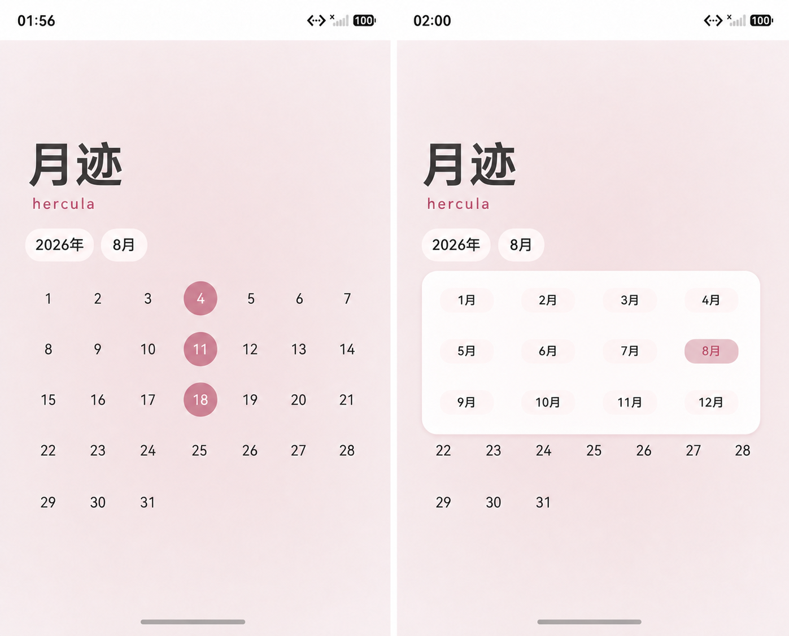

# 月迹 · hercula

一个纯 HarmonyOS 原生、离线优先的经期记录应用。

月迹只做三件事：记录经期开始日、从历史记录计算周期时长、给出透明的下一次经期估算。所有核心数据默认留在设备本地，不需要账号，不依赖云同步。

## 产品展示

当前已完成的界面 1 设计基准是 Pura X 宽折叠展开态：自绘月历、低饱和粉色渐变、圆角年份/月按钮、日期圆形标记，以及年月浮动选择窗。后续多设备重排优先考虑 Pura X 展开横向时的日历与历史双排展示。



历史页采用无边框水平柱状图。日期位于左侧，柱体长度表示周期时长，时长文本放在柱体末端；跨年时年份标识穿插在日期行之间的空隙，不额外占用列表行高。

## 当前状态

| 能力 | 状态 |
| --- | --- |
| ArkTS + ArkUI 原生工程 | 已完成 |
| 本地日期记录、二次点击取消 | 已完成 |
| 未来日期禁止记录 | 已完成 |
| 自绘月历、横向换月、年月跳转 | 已完成 |
| 首次欢迎弹窗 | 已完成 |
| 基于下一条记录起点计算周期时长 | 已完成 |
| 无限历史列表、按日期倒序 | 已完成 |
| JSON v1 导入/导出 | 基础实现，严格校验待补齐，规格见 [JSON Schema](./docs/json_SPEC.md) |
| 简单文本日期导入 | 待实现：分隔符日期解析后匹配 JSON schema |
| 图片 OCR 导入 | 搁置 |
| 小艺 AI 接入 | 搁置，保留调研文档，不作为应用依赖 |
| 多设备 UI 适配 | 待推进，优先完成 Pura X 展开横向双排方案 |
| Index.ets 多组件拆分 | 待基础功能与 UI 组件稳定后，按响应式布局边界拆分 |
| Buy Me a Coffee 卡片 | 待确定入口与收款地址 |

## 设计原则

- 纯鸿蒙原生：ArkTS、ArkUI、Stage 模型、原生系统文件选择能力。
- 本地隐私：不声明网络权限，不接入分析、推送、云同步或远程大模型。
- 低认知负担：日历是主界面，点击日期即可记录，再次点击立即取消。
- 可解释统计：每个柱体都能追溯到日期记录，不把估算包装成医学结论。
- 渐进式建设：先完善功能闭环和基础 UI 组件，再进行 UI 重排与多设备兼容检查；导入先实现 JSON schema 和确定性文本日期解析，暂不引入 AI/OCR。

## 技术结构

```text
entry/src/main/ets/
├── entryability/     # UIAbility 生命周期
├── pages/            # 当前入口页面，暂时组装两页 UI
├── domain/           # 日期、周期时长和预测逻辑
├── data/             # Preferences 与 JSON 文件传输
├── components/       # TODO：多设备布局确定后拆分
└── parser/           # JSON 校验；文本/OCR 暂缓
```

当前工程仍以 `Index.ets` 为主要页面文件。组件拆分不会等待所有设备的最终视觉稿，而是在功能和基础 UI 组件稳定后，先抽取可复用的功能组件，再由响应式页面壳决定单列或双排表现。

## 开发环境与构建

使用当前稳定版 [DevEco Studio](https://developer.huawei.com/consumer/cn/deveco-studio/) 打开项目，并安装匹配的 HarmonyOS SDK。

当前已验证环境：DevEco Studio 6.1.1、内置 HarmonyOS SDK 6.1.1/API 24、Hvigor 6.24.4、ohpm 6.1.2 和 JDK 17.0.20。工程使用 DevEco 自带 SDK，而不是只包含 system-image 的用户 SDK 目录。

```bash
export JAVA_HOME=$(/usr/libexec/java_home -v 17)
export DEVECO_SDK_HOME="/Applications/DevEco-Studio.app/Contents/sdk"
export PATH="/Applications/DevEco-Studio.app/Contents/tools/hvigor/bin:/Applications/DevEco-Studio.app/Contents/tools/ohpm/bin:$JAVA_HOME/bin:$PATH"
/Applications/DevEco-Studio.app/Contents/tools/hvigor/bin/hvigorw assembleApp --no-daemon
```

当前可生成未签名 APP/HAP。发布前仍需配置签名、隐私政策和 AppGallery Connect 资料。

## 导入路线

1. **阶段 1：JSON 导入** — 当前唯一实现和近期重点。读取 `schemaVersion: 1` 文件，完成基础版本检查、预览并合并日期；严格字段校验仍待补齐。
2. **阶段 2：简单文本日期导入** — 待读取明确的年月日分隔符，转换为 JSON 候选并进入确认流程。
3. **阶段 3：拍照/OCR 导入** — 搁置，不进入当前开发计划。

小艺开放平台的 Agent/Skill 能力属于智能体开发与系统入口分发路线，不等同于应用内离线文本解析 API。相关结论记录在 [小艺 AI 调研](./docs/research/xiaoyi-ai-import-research.md)。

## 文档

从 [docs/README.md](./docs/README.md) 开始阅读：

- [产品与交互设计](./docs/research/product-design.md)
- [技术设计](./docs/research/technical-design.md)
- [实施方案与进度](./docs/research/implementation-plan.md)
- [JSON Schema 规格](./docs/json_SPEC.md)
- [UI 动效探索](./docs/research/ui-motion-exploration.md)
- [响应式布局与组件边界探索](./docs/research/responsive-layout-and-component-boundaries.md)
- [基础 UI 组件设计任务](./docs/research/ui-component-design-tasks.md)
- [小艺 AI 与 OCR 调研](./docs/research/xiaoyi-ai-import-research.md)
- [研究资料入口](./docs/research/README.md)

## 支持项目

Buy Me a Coffee 卡片暂不放入应用界面。需要确定收款平台、公开链接和展示位置后，再加入 README 或后续设置页；在此之前不放置虚构链接。
