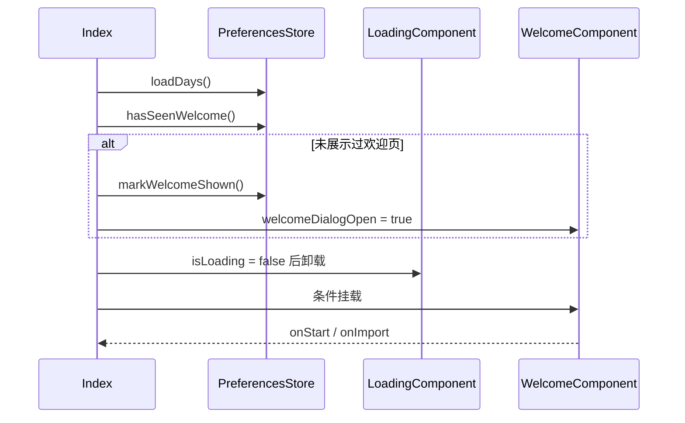
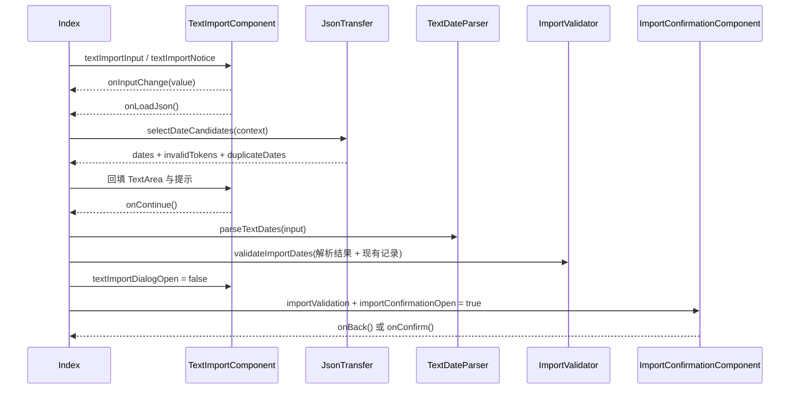

# 第六步：弹层展示组件解析

解析对象：

- `entry/src/main/ets/components/LoadingComponent.ets`
- `entry/src/main/ets/components/WelcomeComponent.ets`
- `entry/src/main/ets/components/TextImportComponent.ets`
- `entry/src/main/ets/components/ImportConfirmationComponent.ets`
- `entry/src/main/ets/components/AboutComponent.ets`

本章先区分两种展示状态：`LoadingComponent` 是根页面的互斥启动分支，其余四个组件是根 `Stack` 上按布尔状态条件挂载的全屏覆盖层。它们都属于弹层展示范围，但通信和生命周期不能混为一谈。

## 1. 弹层为什么存在

这些组件把“需要暂时阻断或覆盖主页面的交互”从 `Index` 的流程编排中分离出来：

```text
Index
├─ isLoading=true
│   └─ LoadingComponent              启动期间的全屏占位
└─ isLoading=false
    └─ ResponsivePageShell           主页面
        ├─ WelcomeComponent           首次使用入口
        ├─ TextImportComponent        输入/加载导入候选
        ├─ ImportConfirmationComponent 导入前预览与确认
        └─ AboutComponent              项目信息展示
```

组件只负责绘制当前状态和发出用户动作。打开哪个弹层、什么时候切换、输入如何解析、确认后如何写入 `markedDays`，都由 `Index` 决定。

## 2. 根页面的挂载与层级

`Index.build()` 使用两套条件：

1. `isLoading` 为真时只挂载 `LoadingComponent`；为假时挂载 `ResponsivePageShell`。
2. 主页面之后，按独立布尔值条件挂载四个覆盖层：文本导入、导入确认、欢迎、关于。

覆盖层使用固定 `zIndex`：

| 组件 | `zIndex` | 当前关闭方式 |
| --- | ---: | --- |
| `TextImportComponent` | 20 | 取消按钮；遮罩点击为空操作 |
| `ImportConfirmationComponent` | 21 | 返回按钮；遮罩点击为空操作 |
| `WelcomeComponent` | 30 | 开始记录或导入数据；遮罩点击为空操作 |
| `AboutComponent` | 30 | 遮罩或卡片点击关闭 |

`welcomeDialogOpen`、`aboutDialogOpen`、`textImportDialogOpen`、`importConfirmationOpen` 是四个相互独立的布尔状态，不是单一弹层枚举。正常流程通过回调顺序维持互斥：导入确认先关闭文本导入再打开确认，返回时反向切换；首次欢迎导入则先关闭欢迎再打开文本导入。

## 3. 各组件的实际职责

### 3.1 `LoadingComponent`

`LoadingComponent` 没有输入、回调或局部状态，只绘制应用启动期间的品牌文字、三点装饰和“正在准备记录”文案。

它不负责：

- 读取 `PreferencesStore`；
- 判断加载是否成功；
- 结束加载；
- 显示 `Index.feedback`。

`Index.loadLocalData()` 在 `finally` 中将 `isLoading` 设为 `false`，因此加载组件的存在时间完全由入口状态控制。它不是普通可叠加弹窗，而是主页面的互斥占位分支。

### 3.2 `WelcomeComponent`

输入：无。

回调：

| 回调 | `Index` 的动作 |
| --- | --- |
| `onStart` | 关闭欢迎弹层，进入主页面 |
| `onImport` | 关闭欢迎弹层并打开文本导入弹层 |

它只承担首次使用说明和两个入口按钮。欢迎标记的读取与写入发生在 `Index.loadLocalData()`，不是由组件决定“是否首次打开”。遮罩没有关闭回调，因此当前实现要求用户通过两个按钮离开欢迎弹层。

### 3.3 `TextImportComponent`

输入：

- `textImportInput`：文本框的受控内容；
- `textImportNotice`：JSON 加载结果或文件错误提示。

回调：

| 回调 | 触发位置 | `Index` 的动作 |
| --- | --- | --- |
| `onInputChange(value)` | `TextArea.onChange` | 更新 `textImportInput` |
| `onLoadJson()` | “从 JSON 文件加载”按钮 | 选择文件、读取候选、回填文本和提示 |
| `onCancel()` | “取消”按钮 | 关闭弹层并清理导入临时状态 |
| `onContinue()` | “继续”按钮 | 解析文本并生成确认模型 |

组件不解析日期、不判断格式、不调用文件选择器，也不写入本地记录。JSON 加载后仍然回填到同一个 `TextArea`，所以 JSON 和手动输入共享后续的“继续”入口。

`textImportNotice` 同时控制提示文字是否渲染和卡片高度：为空时高度为 420，非空时高度增加 40。提示最多显示两行，但组件没有根据实际文本测量高度。

### 3.4 `ImportConfirmationComponent`

输入：一个 `ImportValidationResult`，包含：

```text
candidateDates
validDates
futureDates
duplicateDates
existingDates
invalidTokens
```

回调：

- `onBack()`：返回文本导入弹层；
- `onConfirm()`：请求 `Index` 合并 `validDates`。

确认组件只做三件事：

1. 在摘要中统计识别数、可导入数、重复数和失败数；
2. 遍历 `candidateDates` 与 `invalidTokens`，生成预览行；
3. 当 `validDates` 为空时禁用确认按钮。

每个候选行的状态由 `futureDates`、`existingDates`、`duplicateDates` 再反查得到。确认组件不重新解析日期，也不重新校验今天日期。

### 3.5 `AboutComponent`

输入：`repositoryUrl`，由 `Index` 传入固定仓库地址。

回调：`onClose()`。

它只显示项目名称、隐私说明、仓库地址和支持项目文案。仓库地址是普通 `Text`，组件没有打开链接的回调，也不依赖外部文件或网络能力。

遮罩和信息卡片都绑定了 `onClose()`。因此当前实现中，点击关于卡片内任意位置也会关闭弹层；卡片内没有其他交互元素。

## 4. 通信与状态流

### 4.1 首次打开



欢迎窗口的显示资格来自本地标记，而离开欢迎窗口只通过两个回调完成。

### 4.2 文本与 JSON 导入



确认窗口的回调只表示用户选择，不携带新的日期数据。真正写入发生在 `Index.confirmImport()`，并且只使用 `importValidation.validDates`。

## 5. 当前明确的代码边界问题

以下问题都能从当前代码直接确认，不包含产品功能规划：

1. **四个覆盖层的互斥关系由多个布尔值、条件顺序和固定 `zIndex` 共同维持。** `Index` 没有单一的弹层状态；如果未来新增一个打开路径而没有同步关闭旧状态，代码结构允许多个覆盖层同时挂载。`WelcomeComponent` 和 `AboutComponent` 还共享 `zIndex=30`，其覆盖顺序依赖 `Index.build()` 中的子节点顺序。

2. **遮罩点击语义在组件之间不一致。** 文本导入、确认和欢迎组件的全屏遮罩使用空的 `onClick` 作为点击拦截；关于组件的遮罩和卡片都调用关闭。这个空回调不是普通业务逻辑，但它承担了阻止点击穿透的职责，不能在未验证事件传播前当作死代码删除。

3. **覆盖层外壳在四个文件中重复实现。** 全屏 `Stack`、半透明模糊遮罩、卡片背景、圆角、边框、阴影和进入动画分别写在四个组件内；同时各组件又保留不同的高度、内边距、关闭行为和层级。这里存在明确的重复结构，但不能直接把四个组件合成一个通用业务组件，否则会混淆输入表单、确认列表、欢迎入口和关于展示的职责。

4. **主页面的安全区/运行时度量没有传给覆盖层。** `Index` 获取了安全区和窗口尺寸，但只传给 `ResponsivePageShell`；五个弹层都使用 `100%` 全屏和固定卡片尺寸，不消费 `RuntimeLayoutMetrics`。因此弹层布局与主页面布局使用两套尺寸输入边界。

5. **确认页的行模型与校验结果模型不完全对应。** 确认页只遍历 `candidateDates` 和 `invalidTokens`；`futureDates`、`existingDates`、`duplicateDates` 只用于摘要或反查状态。若某个值只存在于 `duplicateDates` 而不在 `candidateDates` 中，它会计入摘要但不会生成独立预览行。该边界来自组件消费方式，具体重复值如何进入结果属于下一步导入链路分析。

6. **确认动作没有忙状态协议。** `ImportConfirmationComponent` 只有 `onConfirm`，没有 `busy` 或禁用输入的属性；`Index.build()` 中的回调直接调用异步 `confirmImport()` 而不等待。持久化完成前确认页仍保持可交互，重复点击可能再次执行同一批 `validDates` 的内存合并。

## 6. 不应误判为死代码的对象

- 三个覆盖层遮罩上的空 `onClick` 具有点击拦截作用，不能仅因回调体为空删除。
- `ImportConfirmationComponent` 中 `futureDates`、`existingDates` 和 `duplicateDates` 虽不单独遍历，但被 `importStatus()` 和摘要使用，不能按“没有直接渲染”删除。
- `LoadingComponent` 没有回调不是缺少通信；它的生命周期由 `Index.isLoading` 的互斥分支决定。
- `WelcomeComponent` 没有关闭按钮与当前代码一致；其遮罩也不会关闭，不能把它和 `AboutComponent` 的点击关闭行为视为同一协议。

## 7. 本步骤结论

弹层组件的实际分工是：

```text
Index
  ├─ 决定挂载和切换
  ├─ 持有输入、提示和校验结果
  └─ 执行文件、解析、校验、持久化

弹层组件
  ├─ 展示受控状态
  ├─ 转发用户动作
  └─ 不直接改变 markedDays 或本地存储
```

后续整理时，应先保留这条单向通信边界，再单独处理重复覆盖层外壳、弹层状态协议、确认页行模型和异步确认期间的交互状态。它们是不同问题，不能用一个“大弹窗组件”一次性替代。
