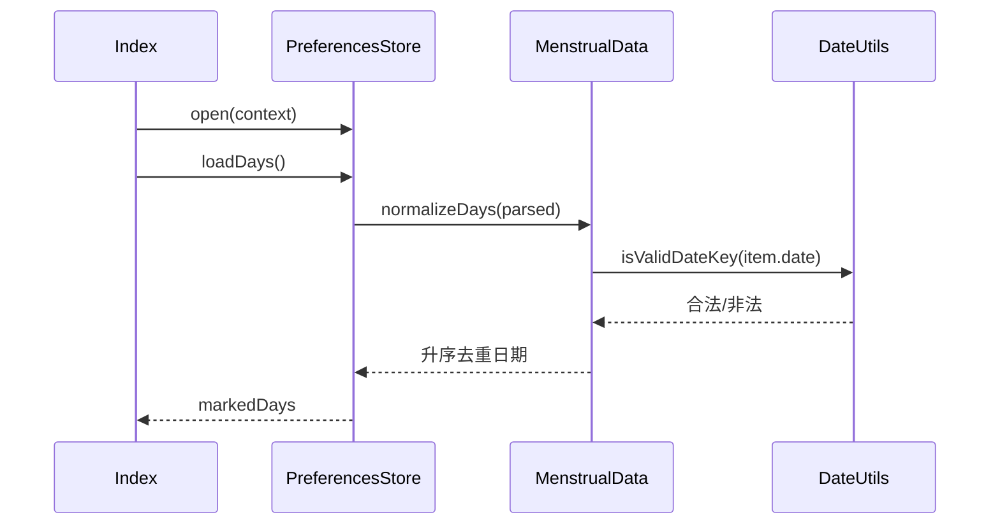

# 第八步：数据基础层解析

解析对象：

- `entry/src/main/ets/data/PreferencesStore.ets`
- `entry/src/main/ets/domain/DateUtils.ets`
- `entry/src/main/ets/domain/MenstrualData.ets`

这三部分共同构成当前应用的数据基础，但职责并不相同：

```text
PreferencesStore
  └─ 读取/写入 JSON 字符串
       └─ MenstrualDay[]
            └─ normalizeDays()
                 └─ DateUtils.isValidDateKey()

MenstrualDay[]
  ├─ derivePeriods()      -> PeriodSummary[]
  └─ predictNextPeriod()  -> Prediction
```

`DateUtils` 不保存状态，`MenstrualData` 不访问系统存储，`PreferencesStore` 不计算经期统计。`Index` 是三者与页面之间的汇聚者。

## 1. 日期表示：`DateUtils`

### 1.1 唯一日期键

应用内部的日期事实使用本地日历日期键：

```text
YYYY-MM-DD
```

相关函数：

| 函数 | 作用 | 时区边界 |
| --- | --- | --- |
| `toDateKey(date)` | 将本地 `Date` 转为日期键 | 使用设备本地年月日 |
| `todayKey()` | 获取设备当前本地日期 | 不使用 UTC 日期 |
| `parseDateKey(value)` | 将日期键按本地年月日构造 `Date` | 不解析时区或时间部分 |
| `addDays(value, amount)` | 对日期键做本地日期加减 | 依赖本地 `Date` 的日期进位 |
| `dayDistance(from, to)` | 计算两个日期键的日差 | 用本地时间戳差除以 24 小时并四舍五入 |
| `isValidDateKey(value)` | 同时检查格式和年月日回构结果 | 只接受严格 `YYYY-MM-DD` |
| `formatShortDate(value)` | 生成 UI 月日文案 | 调用方必须传入合法键 |
| `monthTitle(date)` | 生成年月标题 | 当前没有调用方 |

日期键使用固定宽度年月日，因此代码中的字典序比较可以代表日期先后，例如：

```ts
date > today
```

这条前提只对已经通过 `isValidDateKey()` 的标准日期键成立。

### 1.2 合法性检查与解析前提

`parseDateKey()` 本身不拒绝非法日期。JavaScript `Date` 会对超出范围的月份或日期进行进位，例如非法日期可能被构造成另一个合法日期。真正的合法性由 `isValidDateKey()` 完成：

1. 要求严格匹配四位年、两位月、两位日；
2. 调用 `parseDateKey()`；
3. 比较回构后的年月日是否与原字符串一致。

因此 `addDays()`、`dayDistance()` 和 `formatShortDate()` 都隐含要求调用方先提供合法日期键。当前生产调用满足这个前提：导入经过校验，存储读取经过 `normalizeDays`，统计来自规范化日期。

### 1.3 本地日期的计算范围

日期键不携带时区，`todayKey()`、`parseDateKey()`、`addDays()` 和 `dayDistance()` 都以设备本地时区计算。导出文件中的 `exportedAt` 使用 ISO 时间戳，但它只是文件元数据，不参与日期事实和周期计算。

## 2. 事实模型与规范化：`MenstrualData`

### 2.1 `MenstrualDay`

```ts
interface MenstrualDay {
  date: string;
  source: 'manual' | 'import';
}
```

`date` 是唯一事实键；`source` 只记录写入来源，当前统计不区分来源。经期时长、是否进行中和预测都不写回 `MenstrualDay`。

### 2.2 `normalizeDays`

`normalizeDays(days)` 是事实集合的入口规范化函数：

1. 遍历输入数组；
2. 丢弃 `date` 不符合合法 `YYYY-MM-DD` 的条目；
3. 以 `date` 为键写入 `Map`；
4. 同一日期后出现的条目覆盖先出现的条目；
5. 按日期键升序输出。

它被三个地方使用：

- `PreferencesStore.loadDays()`：恢复本地数据；
- `PreferencesStore.saveDays()`：写入前清理数据；
- `JsonTransfer.export()`：生成 JSON 文件前清理数据。

`normalizeDays` 不过滤未来日期，也不重新验证 `source`。未来日期由手动记录和导入校验阻断，统计函数另外过滤未来日期；来源枚举依靠 ArkTS 类型和 JSON 导入解析阶段的检查，而不是由事实规范化函数运行时检查。

### 2.3 `derivePeriods`

`derivePeriods(days, today)` 将每个已保存日期解释为一个经期开始日：

```text
normalizeDays(days)
  -> 提取日期
  -> 过滤 date <= today
  -> 按日期升序遍历
```

对每个开始日：

- 如果存在下一条开始日：
  - `endDate = nextDate - 1 day`；
  - `durationDays = dayDistance(startDate, nextDate)`；
  - `ongoing = false`。
- 如果没有下一条开始日：
  - `endDate = today`；
  - `durationDays = max(1, dayDistance(startDate, today))`；
  - `ongoing = true`。

因此历史经期时长是相邻开始日的间隔，而不是把结束日和开始日都加进来的差值；最后一条记录使用今天作为临时结束日。现有测试覆盖了跨年间隔和历史记录不应使用今天重算的问题。

### 2.4 `predictNextPeriod`

`predictNextPeriod(periods)` 只接收已经派生出的 `PeriodSummary[]`，不读取原始日期、不读取系统时间：

1. 移除 `ongoing=true` 的最后一条或其他进行中记录；
2. 少于 3 条完整经期时返回不可用提示；
3. 计算完整经期开始日之间的相邻间隔；
4. 升序排序间隔；
5. 取 `Math.floor(length / 2)` 位置的值；
6. 将该间隔加到最后一个完整经期开始日，生成预测文案。

当前实现取的是排序后数组的上侧中位位置：当间隔数量为偶数时，不取两个中间值的平均值。函数也假设输入 `periods` 已按开始日升序排列；当前调用方 `derivePeriods()` 满足这一前提，但函数内部没有再次排序或验证。

### 2.5 `buildCalendarCells`

`buildCalendarCells(year, month)` 生成固定 42 格、以周一为一周起点的日历单元，并为每格提供：

```ts
interface CalendarCell {
  key: string;
  day: number;
  date: string;
  inCurrentMonth: boolean;
}
```

它使用 JavaScript `Date` 的零基月份参数，并把 `month` 直接传给 `new Date(year, month, 1)` 和 `getMonth() === month`。当前 `CalendarComponent` 没有调用它，而是自己生成当月 1 到最后一天；组件的月份按钮使用 1–12，再在调用 `Date` 时转换为零基月份。工程中因此存在两套日历格模型，且月份参数契约也没有被统一到共享函数上。

## 3. 本地持久化：`PreferencesStore`

### 3.1 存储键和生命周期

`PreferencesStore.open(context)` 打开固定名称的 ArkData Preferences 容器：

| 标识 | 类型 | 内容 |
| --- | --- | --- |
| `hercula-local-data` | store name | 应用本地 Preferences 容器 |
| `menstrual-days` | string | `MenstrualDay[]` 的 JSON 字符串 |
| `welcome-shown` | boolean | 是否已经写入首次欢迎标记 |

它没有独立的实例状态对象、版本号或迁移逻辑。实例只持有一个可能为空的 `preferences.Preferences` 引用。

### 3.2 打开与读取

```text
PreferencesStore.open(context)
  ├─ 成功 -> 保存 Preferences 引用
  └─ 失败 -> 引用保持 undefined，但仍返回 Store 实例

loadDays()
  ├─ 无引用 -> []
  ├─ 读取/JSON.parse/normalizeDays 成功 -> 规范化日期数组
  └─ 任意异常 -> []
```

`hasSeenWelcome()` 的结构相同：无法使用 Preferences 或读取异常时返回 `false`。因此调用方看不到“没有记录”和“本地存储不可用/损坏”的区别。

### 3.3 写入

`saveDays(days)` 先调用 `normalizeDays()`，再写入 JSON 字符串并 `flush()`。`markWelcomeShown()` 写入布尔值并 `flush()`。两者都捕获异常并返回 `void`，调用方无法确认写入是否成功。

`Index` 的当前流程是先更新内存 `markedDays`，再等待 `saveDays()`；保存失败时内存仍保留新数据，但下次启动可能恢复旧数据或空数组。欢迎标记在欢迎弹层打开前写入，若写入失败，下一次启动会重新判断为未展示过。

## 4. 三层之间的调用关系

### 启动恢复



### 历史统计

```text
Index.markedDays
  -> HistoryComponent
      -> derivePeriods(markedDays, todayKey())
          -> normalizeDays
              -> isValidDateKey / parseDateKey / addDays / dayDistance
      -> predictNextPeriod(periods)
          -> dayDistance / addDays / parseDateKey
```

### 导入确认

导入链路先由 `ImportValidator` 产出 `validDates`，确认后才构造 `MenstrualDay`；`PreferencesStore.saveDays()` 再次规范化写入。数据基础层不负责决定“用户是否确认”，导入链路也不绕过事实规范化。

## 5. 测试覆盖与当前证据

现有测试直接覆盖：

- `MenstrualData.test.ets`：跨年历史间隔、历史经期不使用今天重新计算；
- `ImportValidator.test.ets`：未来日期、已有日期、重复和问题保留；
- `JsonTransfer.test.ets`：JSON 日期合法性和重复；
- `TextDateParser.test.ets`：日期表达式和标准化；
- `List.test.ets`：注册上述测试入口。

当前没有针对以下数据基础边界的测试：

- Preferences 打开失败、读取损坏 JSON、写入/flush 失败；
- `normalizeDays` 对非法 `source`、空条目或重复来源的处理；
- `parseDateKey` 收到非法日期时的归一化行为；
- `predictNextPeriod` 输入未排序或偶数间隔时的中位数规则；
- `buildCalendarCells` 的零基月份契约和当前无调用方状态。

## 6. 当前明确的代码边界问题

1. **存储错误被折叠为空数据或默认状态。** `open()` 失败、`loadDays()` 读取失败、JSON 损坏和 `hasSeenWelcome()` 读取失败分别都会表现为可继续运行的空数组或 `false`；调用方无法区分“确实没有记录”和“数据不可用”。

2. **保存接口不返回结果。** `saveDays()` 和 `markWelcomeShown()` 吞掉 `put/flush` 异常并返回 `void`，`Index` 只能确认内存状态已经变化，不能确认本地数据已落盘。

3. **事实规范化不校验 `source`。** `normalizeDays()` 只验证日期键；从 Preferences 解析出的任意 `source` 值会被保留并可能再次导出。JSON 文件解析会单独校验来源，但本地存储恢复和导出前规范化没有同等运行时约束。

4. **日期工具的合法性责任由调用方承担。** `parseDateKey()` 对非法日期会使用 `Date` 的进位行为，`addDays()`、`dayDistance()`、`formatShortDate()` 也不主动拒绝非法输入。当前主要调用路径满足前置校验，但这些函数本身没有显式保护。

5. **经期时长规则集中在 `derivePeriods()`，并且使用日期间隔而非含首尾计数。** `endDate` 看起来是闭区间终点，但 `durationDays` 使用开始日到下一开始日的差值；最后一条又使用 `max(1, dayDistance(startDate, today))`。重构时不能仅根据字段名把计算改成 `+1`。

6. **预测函数的输入顺序和中位数规则是隐式前提。** `predictNextPeriod()` 不排序输入，偶数个周期间隔时取上侧中位位置；当前调用方依赖 `derivePeriods()` 的升序结果。把它迁移成独立服务时若增加排序或改用平均中位数，都会改变当前结果。

7. **日历格逻辑存在未接入的第二套实现。** `buildCalendarCells()` 生成固定 42 格并使用零基月份，当前 `CalendarComponent` 自己生成连续当月日期且不调用它；该函数不是当前日历 UI 的数据来源，但也不能只凭无调用方删除而忽略月份契约。

8. **本地存储格式没有版本边界。** `PreferencesStore` 直接把日期数组写成 JSON 字符串，没有 schemaVersion、迁移分支或损坏数据隔离；一旦字段结构变化，当前读取路径只能进入 `[]` 或保留部分可规范化数据。

## 7. 不应误判为死代码的对象

- `normalizeDays()` 虽然在读取、保存、导出和统计中多次调用，但它承担日期集合去重、排序和非法日期过滤，不是普通重复计算。
- `derivePeriods()` 的 `today` 参数不是冗余，它决定进行中经期的结束日和未来日期过滤，也让测试可以固定日期。
- `buildCalendarCells()` 当前没有调用方，但它与 `CalendarComponent` 的连续日期网格不是等价实现，必须先确认日历格责任再处理。
- `DateUtils.monthTitle()` 当前没有引用，是未使用导出候选；它与 `normalizeDays`、`derivePeriods` 不存在隐藏调用关系。

## 8. 本步骤结论

数据基础层可以明确收敛为三条边界：

```text
DateUtils
  -> 只提供本地日期键和日期运算

MenstrualData
  -> 规范化事实集合
  -> 从事实集合派生经期与预测

PreferencesStore
  -> 负责本地 JSON 字符串和欢迎标记的读写
  -> 不负责统计、不负责导入确认
```

下一阶段整理时，优先保留日期键不变量、`normalizeDays` 的去重排序、`derivePeriods` 的当前时长规则和确认后落库顺序；存储错误语义、`source` 运行时校验、备用日历模型和未使用格式化函数应在全局引用审查后分别处理，不能混成一次数据层重写。
