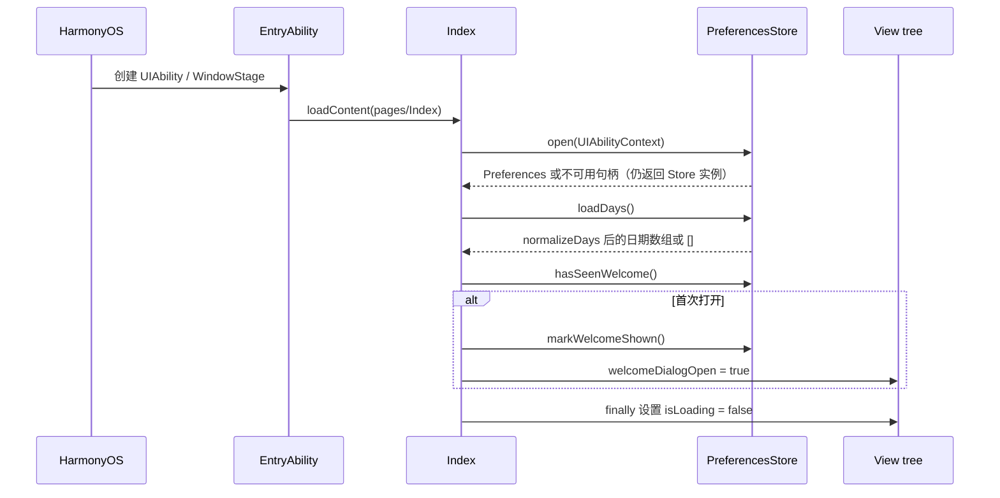
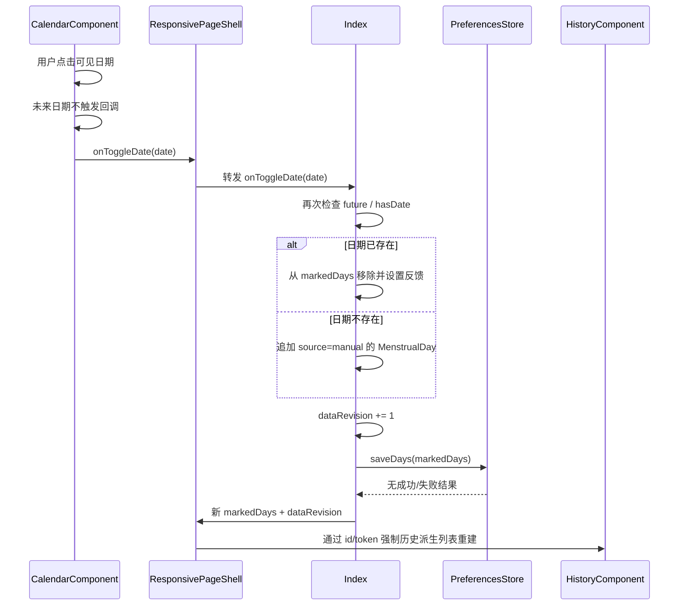
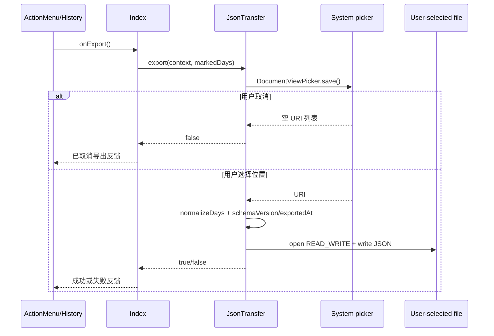

# 运行流程与数据流

## 0. 总体状态与所有权

当前运行时只有一个业务事实源和三类临时/派生状态：

```text
Index
├─ 事实状态
│   └─ markedDays: MenstrualDay[]
├─ UI/流程状态
│   ├─ isLoading
│   ├─ 四个弹层布尔值
│   ├─ textImportInput / textImportNotice
│   └─ importValidation / jsonImportIssues
├─ UI 缓存刷新状态
│   └─ dataRevision
└─ 窗口状态
    ├─ windowWidth / windowHeight
    ├─ safeAreaTopInset / safeAreaBottomInset
    └─ densityPixels
```

所有权边界：

| 状态 | 唯一拥有者 | 下游消费者 | 是否写本地 |
| --- | --- | --- | --- |
| `markedDays` | `Index` | Calendar、History、导出、导入合并 | 是 |
| `dataRevision` | `Index` | History 根节点 id | 否 |
| 导入临时状态 | `Index` | TextImport、ImportConfirmation | 否 |
| 弹层显示状态 | `Index` | 根 `Stack` 的条件挂载 | 否 |
| 当前月份/拖拽状态 | CalendarComponent | CalendarComponent 自身 | 否 |
| 统计结果 | HistoryComponent 临时派生 | HistoryComponent 自身 | 否 |
| 布局度量 | ResponsivePageShell 临时派生 | Calendar、History、ActionMenu | 否 |

组件只通过输入属性接收状态、通过回调返回动作；`PreferencesStore`、`JsonTransfer` 和 domain 纯函数都由 `Index` 直接调用。当前没有跨组件共享单例、`@Link` 或事件总线。

## 1. 启动与恢复



系统启动窗口由 `start_window.json` 控制，`LoadingComponent` 由 `Index.isLoading` 控制；前者结束后才进入后者。`EntryAbility.onWindowStageCreate()` 加载页面失败时只有日志出口，失败不会进入 `Index`。

窗口度量是另一条并行的生命周期流：`onPageShow` 获取窗口，注册 `windowSizeChange`、`windowRectChange`、`avoidAreaChange`；事件更新 `Index` 状态，`ResponsivePageShell` 再计算新的 `RuntimeLayoutMetrics`。`onPageHide` 负责解绑，避免页面切换后继续接收窗口事件。

`PreferencesStore` 将打开失败、读取异常和损坏 JSON 折叠为空句柄、空数组或 `false`；保存方法吞掉异常且不返回结果。因此启动流程只能保证页面继续渲染，不能证明本地数据恢复成功。

## 2. 手动记录日期



日历的当前月份、滑动动画和年/月跳转只停留在 `CalendarComponent` 内，不经过 `Index`，因此它们不会触发持久化或历史重算。

手动记录先更新内存 `markedDays`，再调用保存；保存失败时页面内存仍然显示新状态，但下次启动可能恢复旧数据或空数组。`Index.feedback` 会记录成功/失败文案，但当前没有 UI 消费者。

## 3. 历史统计

```text
Index.markedDays
  └─ ResponsivePageShell
      └─ HistoryComponent
          ├─ todayKey()
          ├─ derivePeriods(markedDays, today)
          │   └─ normalize、排序、过滤未来、计算 PeriodSummary
          ├─ currentPeriodsDescending()
          │   └─ 历史列表、年份分隔
          ├─ predictNextPeriod(currentPeriods())
          │   └─ 预测文案
          └─ periodScaleMax / periodRatio
              └─ 柱状图宽度
```

统计没有专门的缓存层。`refreshToken` 和根节点 `id` 只是对 ArkUI 离屏缓存的重建信号，不是统计数据版本。

`derivePeriods()` 每次从 `markedDays` 重新规范化、按日期升序、过滤未来日期并计算 `PeriodSummary`；`predictNextPeriod()` 只消费已派生的完整周期，并使用当前实现的上侧中位间隔。统计结果不写入 Preferences 或 JSON。

空状态时，历史页展示导入按钮；有历史时，操作菜单展示导入、导出和关于。两条入口最终都回调到 `Index`。

## 4. 文本/JSON 导入

```mermaid
flowchart TD
  A[用户点击导入入口] --> B[Index 打开 TextImportComponent]
  B --> C{输入来源}
  C -->|直接输入| D[textImportInput]
  C -->|JSON 文件| E[DocumentViewPicker.select]
  E --> F[读取文件 <= 4 MiB]
  F --> G[parseJsonDateCandidates]
  G --> H[日期回填 TextArea + JSON 问题保留]
  D --> I[parseTextDates]
  H --> I
  I --> J[validateImportDates]
  J --> K{有候选或问题?}
  K -->|否| L[反馈：请输入明确格式日期]
  K -->|是| M[ImportConfirmationComponent]
  M --> N{用户动作}
  N -->|返回| B
  N -->|取消/关闭| O[清理导入临时状态，不改 markedDays]
  N -->|确认| P[validDates -> MenstrualDay(source=import)]
  P --> Q[合并 markedDays]
  Q --> R[saveDays + dataRevision]
  R --> S[关闭弹层并显示结果]
```

导入链路的边界如下：

- `TextImportComponent` 只负责编辑，不知道日期语法。
- `JsonTransfer` 只负责用户选文件、读取文本、检查 JSON 外形并提取候选，不直接修改 `Index.markedDays`。
- `TextDateParser` 只负责语法识别。
- `ImportValidator` 只负责把候选与今天、本地已有数据合并成可展示的分类结果。
- `ImportConfirmationComponent` 只负责确认前展示和发出确认/返回回调。
- `Index.confirmImport` 是唯一将确认结果写入事实数据的入口。

文本格式、JSON 文件候选、备用 JSON 导入方法和分类数组的具体边界见[第七步导入链路解析](./07-import-pipeline.md)。

导入的几个不可混淆的状态：

| 情况 | `JsonTransfer` 返回 | `Index` 当前行为 |
| --- | --- | --- |
| 用户取消选择 | `undefined` | 静默返回 |
| 文件为空、过大或读取失败 | `undefined` | 与取消选择无法区分 |
| JSON 格式/schema 错误 | 抛出异常 | 写入 `textImportNotice` |
| JSON 空 `days` | 空候选、无问题 | 继续时不进入确认页，写入无输入反馈 |
| 用户编辑 JSON 回填文本 | 文本重新解析，但旧 JSON 问题仍保留 | 问题数组与当前文本未重新关联 |

只有 `ImportValidationResult.validDates` 可以进入确认落库；`JsonTransfer.import()` 不在这条约束内，当前没有页面调用方。

## 5. 弹层挂载与关闭

```text
Index.isLoading
  ├─ true  ─> LoadingComponent（互斥启动分支）
  └─ false ─> ResponsivePageShell
                 ├─ welcomeDialogOpen ───────> WelcomeComponent
                 ├─ textImportDialogOpen ────> TextImportComponent
                 ├─ importConfirmationOpen ──> ImportConfirmationComponent
                 └─ aboutDialogOpen ─────────> AboutComponent
```

四个覆盖层状态彼此独立，当前流程通过回调顺序维持导入文本与确认窗口的切换关系。弹层组件不直接关闭其他组件，也不访问 `PreferencesStore`、文件选择器或 `markedDays`；它们只把动作回调给 `Index`。`LoadingComponent` 不属于这条覆盖层链路，它在 `isLoading` 分支中替代主页面。

关闭语义不是统一协议：文本导入、导入确认和欢迎弹层的遮罩点击为空操作，分别依靠按钮离开；关于弹层的遮罩和卡片点击都会触发 `onClose`。覆盖层还没有接收 `safeAreaTopInset`、`safeAreaBottomInset` 或 `RuntimeLayoutMetrics`，其卡片尺寸由各组件的固定常量决定。

## 6. JSON 导出



导出只读当前内存中的 `markedDays`，失败不修改内存和 Preferences。

`JsonTransfer.export()` 返回的 `false` 同时表示用户取消和文件写入失败；`Index.exportJson()` 因此会把两种情况分别映射为“已取消导出”或异常分支，无法从 `false` 本身可靠区分。导出写入使用 `READ_WRITE`，当前代码也没有显式截断已有目标文件，文件写入行为属于后续验证边界。

## 7. 窗口与布局通信

```text
WindowStage / Window
  ├─ windowRect.width/height ─> Index.windowWidth/windowHeight
  ├─ display.densityPixels ──> Index.densityPixels
  └─ system avoid area ───────> Index.safeAreaTop/BottomInset
                                      │
                                      ▼
                         ResponsivePageShell.layoutMetrics()
                                      │
                                      ▼
                 Calendar / History / ActionMenu 的布局 props
```

布局变化不会修改日期事实，也不会触发导入、统计持久化或导出；它只改变组件组合和视觉参数。scroll 模式还会把方向策略设为纵向，其他模式使用自动旋转策略。

`module.json5` 初始方向是 `auto_rotation`，`Index.applyOrientationPolicy()` 在窗口尺寸更新后再次设置方向偏好；因此方向配置同时存在于模块元数据和页面生命周期。

## 8. 通信风险点

- `dataRevision` 是通过改变节点 `id` 解决 UI 缓存问题的间接通信；迁移统计逻辑时必须验证历史页在 `Swiper` 离屏后仍刷新。
- `feedback` 有完整的写入路径，但没有展示路径；用户可能收不到“已记录/导出失败”等反馈。是否补显示或删除状态需由 UI 验收决定，本轮不改。
- `jsonImportIssues` 从 JSON 回填到文本框后再被文本解析；这意味着 JSON 问题与用户编辑后的文本结果并存，不能把 JSON 结果当成本地数据。
- `HistoryComponent` 多次重复调用 `currentPeriods()`，目前是纯函数重算，不会改变结果，但重构时需要避免引入不同的“当前日期”或不一致快照。
- `ImportConfirmationComponent` 只把 `candidateDates` 和 `invalidTokens` 生成预览行，其他分类数组通过摘要或状态反查使用；分类结果中只存在于 `duplicateDates` 的值不会单独生成预览行。
- `Index.confirmImport()` 是异步回调，但确认组件没有忙状态输入；持久化完成前确认按钮仍可能再次触发。
- `PreferencesStore.loadDays()` 将损坏数据当作空数组，`saveDays()` 无成功结果；数据流图中的“恢复/保存”不等于磁盘操作已成功。
- `JsonTransfer.import()` 和页面实际的 `selectDateCandidates()` 是两套 JSON 入口，前者绕过统一校验与确认。
- `EntryAbility` 页面加载失败只有日志出口，无法进入页面级错误处理。
